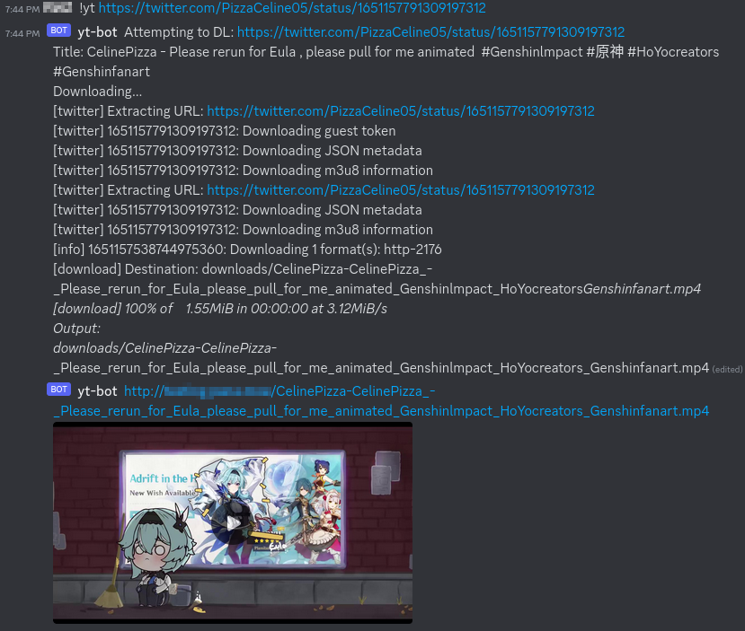

# YTDLP called via Discord commands → locally hosted downloads
On your server, assuming it's Debian based (e.g. Ubuntu, Raspberry Pi, etc.):

    sudo apt install docker.io docker-compose git
    git clone https://github.com/VS-W/python-discord-bot-ytdlp
    cd python-discord-bot-ytdlp

Replace the values for User ID/Group ID/DISCORD_TOKEN in docker-compose.yml with your own. Replace PUBLIC_ADDRESS with the address of your server, web server runs on port 5000 unless modified (e.g. "162.168.56.52:5000" or "subdomain.domain.tld").

Run the following to see your IDs:

    echo User ID: $(id -u)
    echo Group ID: $(id -g)

  
Get your discord token from [here](https://discordapp.com/developers/applications):

 - Create an application. Go to the "Bot" tab.
 - Click "Add Bot" and copy  the token displayed, that's your "DISCORD_TOKEN" to paste into the docker-compose.yml file.
 - Go to the "OAuth2" tab.
 - Click "URL Generator" and check the box for "bot" in the "Scopes" field.
 - Under the "Bot Permissions" field, check "Read Messages/View Channels" and "Send Messages" - that's all this bot requires.
 - Scroll down and click "copy" on the generated URL, and open the URL in your web browser and authorize it.
 
Example running on 162.168.56.52 port 8500:

    version: "3"
    services:
      dsc-yt-bot:
        build:
          context: .
          args:
            USER_ID: 1000
            GROUP_ID: 1000
        volumes:
          - .:/app
        environment:
          PUBLIC_ADDRESS: "162.168.56.52:8500"
          DISCORD_TOKEN: "J8BDCVIspV60BroJPBCQAtucGr2muxaA70Mbtb003h0gJ2gZ5AjBu5kGVBjfRvCUYUuKWg8d"
		  QUIET: "true"
        restart: always
      static-web-server:
        image: joseluisq/static-web-server
        ports:
          - "8500:80"
        volumes:
          - ./downloads/:/public
        restart: always

Change the value of the "QUIET" variable to false if you want to see most of the relevant output of the Youtube-DLP call in the message from the bot, otherwise it will only emit the title, download progress, current status, and any errors.

Back on your server, run the following in the same directory you cloned the repo to:

    sudo docker-compose up -d

In your Discord channel with the bot invited, command:

    !yt VIDEO_URL

Should output the videos to the "downloads" directory.

A [web server](https://github.com/joseluisq/static-web-server) is deployed listening on port 5000 - modify this in docker-compose.yml, if necessary. Should provide a simple file listing with links for all of the videos in that "downloads" directory, updates via simple polling of the index created by the bot when it downloads a new video (will update to using sockets later on).

Works for anything YT-DLP can download, e.g.:

# Options
Arguments can be added to the options.json file, in JSON format. See [here](https://github.com/yt-dlp/yt-dlp/blob/master/yt_dlp/YoutubeDL.py) for the options available.

Example adding the options for "writedescription" and file "format":

    {
        "quiet": true,
        "no_warnings": true,
        "restrictfilenames": true,
        "outtmpl": "downloads/%(uploader)s-%(title)s.%(ext)s",
        "format": "bestvideo[vcodec^=avc1][filesize<?100M][ext=mp4]+bestaudio[acodec^=mp4a]/best",
        "writedescription": true
    }

Restricting the format to H264 in an MP4 container and approximately 100M in size or less as in the above example seems work well for automatic embedding, with the obvious loss of quality for longer videos being forced into those constraints - fall back to just downloading the best available if that's not possible, since any video is better than none.

# Notes

* It is only serving files over http - the direct download links will display warnings in browsers since it's not secure.
* Works without a domain (i.e. using only the server IP), but with the caveat that the embedded videos will not play properly directly Discord - clicking the link the bot generates still renders a playable video, however.

Personally running it on an existing server proxied behind nginx and Cloudflare handling certs and redirecting to https.
